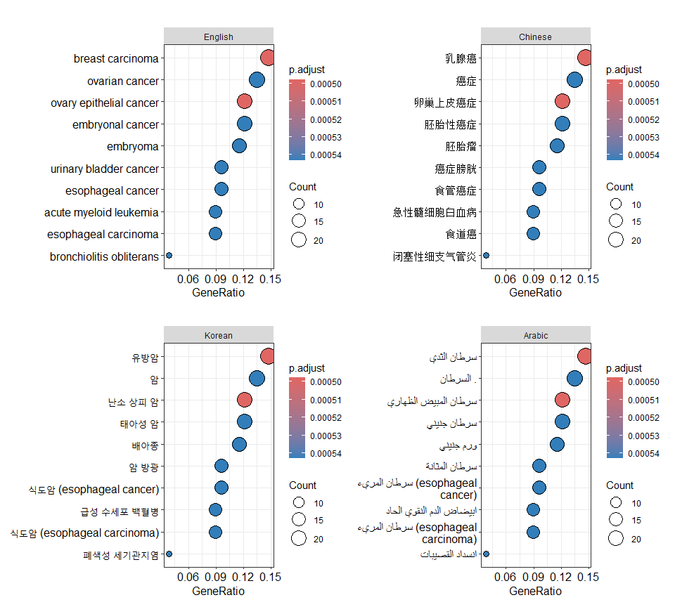

<!-- README.md is generated from README.Rmd. Please edit that file -->

# `fanyi`: Translate Words or Sentences via Online Translators

[](https://cran.r-project.org/package=fanyi)


Useful functions to translate text for multiple languages using online
translators. For example, by translating error messages and descriptive
analysis results into a language familiar to the user, it enables a
better understanding of the information, thereby reducing the barriers
caused by language. It offers several helper functions to query gene
information to help interpretation of interested genes (e.g., marker
genes, differential expression genes), and provides utilities to
translate ggplot graphics.

To cite fanyi in publications use:

G Yu. Using fanyi to assist research communities in retrieving and
interpreting information. ***bioRxiv***, 2023. doi:
[10.1101/2023.12.21.572729](https://www.biorxiv.org/content/10.1101/2023.12.21.572729).

## :writing_hand: Authors

Guangchuang YU

School of Basic Medical Sciences, Southern Medical University

<https://yulab-smu.top>

## :arrow_double_down: Installation

Get the released version from CRAN:

``` r
install.packages("fanyi")
```

Or the development version from github:

``` r
## install.packages("yulab.utils")
yulab.utils::install_zip_gh("YuLab-SMU/fanyi")
```

## :beginner: Usages

### to switch from different online translators:

use `set_translate_source()` to set the default translator using in
`translate()`

### to use `baidu` translate:

1.  go to <https://fanyi-api.baidu.com/manage/developer> and regist as
    an individual developer
2.  get `appid` and `key` (密钥)
3.  set `appid` and `key` with `source = "baidu"` using
    `set_translate_option()`
4.  have fun with `translate()`

### to use `bing` translate:

1.  regist a free azure account
2.  enable `Azure AI services | Translator` from
    <https://portal.azure.com/>
3.  create a translation service with free tier pricing version (you
    need a visa/master card to complete registion and will not be
    charged until exceed 2 million characters monthly)
4.  get your `key` and `region`
5.  set `key` and `region` with `source = "bing"` using
    `set_translate_option()`
6.  have fun with `translate()`

### to use `youdao` translate:

1.  go to <https://ai.youdao.com/> and register an account
2.  click `自然语言翻译服务` and create an app from subsection
    `文本翻译`
3.  get your `应用ID` as appid, and `应用秘钥` as key
4.  set `appid` and `key` with `source = "youdao"` using
    `set_translate_option()`
5.  have fun with `translate()`
6.  (bonus) you can also create `术语表` (dictionary for the terms) as a
    user-defined dictionary and get the dict id to help you get precise
    translation in certain domain.

## to use `huoshan(volcengine)` translate:
1. go to <https://www.volcengine.com/> and register an account
2. click `控制台` and click your avatar at the upper-right corner and 
   select `API访问密钥`
3. click `新建密钥`
4. for security concerns, you are highly advised to add a sub-account (新建子用户)
5. click the sub-account name in `身份管理` - `用户`, and click `permissions` (权限)
6. in `Global permissions` (全局权限), add the following permission: 
   "TranslateFullAccess"、"I18nTranslateFullAccess"
7. have fun with `translate()`

### helper functions:

- `gene_summary()` allows retrieving gene information from NCBI.
- `translate_ggplot()` allows translating axis labels of a ggplot graph.

## :ideograph_advantage: Examples

``` r
library(fanyi)

##
## run `set_translate_option()` to setup
##

text <- 'clusterProfiler supports exploring functional 
    characteristics of both coding and non-coding genomics 
    data for thousands of species with up-to-date gene annotation'
```

``` r
translate(text, from='en', to='zh')
```

> clusterProfiler支持通过最新的基因注释探索数千个物种的编码和非编码基因组学数据的功能特征

``` r
translate(text, from='en', to='jp')
```

> clusterProfilerは、最新の遺伝子注釈による数千種の種の符号化および非符号化ゲノム学データの機能的特徴の探索を支援する

``` r
library(DOSE)
library(enrichplot)
data(geneList)
de <- names(geneList)[1:200]
x <- enrichDO(de)
p <- dotplot(x)
p2 <- translate_ggplot(p, axis='y')
p3 <- translate_ggplot(p, axis='y', to='kor')
p4 <- translate_ggplot(p, axis='y', to='ara')
aplot::plot_list(English = p, Chinese = p2, 
                Korean = p3, Arabic = p4, ncol=2)
```

<!-- -->

``` r
symbol <- c("CCR7", "CD3E")
gene <- clusterProfiler::bitr(symbol, 
            fromType = 'SYMBOL', 
            toType = 'ENTREZID', 
            OrgDb = 'org.Hs.eg.db')

gene
```

    ##   SYMBOL ENTREZID
    ## 1   CCR7     1236
    ## 2   CD3E      916

``` r
res <- gene_summary(gene$ENTREZID)
names(res)
```

    ## [1] "uid"         "name"        "description" "summary"

``` r
d <- data.frame(desc=res$description,
              desc2=translate(res$description))
d
```

    ##                                             desc                     desc2
    ## 1                 C-C motif chemokine receptor 7      C-C基序趋化因子受体7
    ## 2 CD3 epsilon subunit of T-cell receptor complex T细胞受体复合体的CD3ε亚基

``` r
res$summary
```

> \[1\] The protein encoded by this gene is a member of the G
> protein-coupled receptor family. This receptor was identified as a
> gene induced by the Epstein-Barr virus (EBV), and is thought to be a
> mediator of EBV effects on B lymphocytes. This receptor is expressed
> in various lymphoid tissues and activates B and T lymphocytes. It has
> been shown to control the migration of memory T cells to inflamed
> tissues, as well as stimulate dendritic cell maturation. The chemokine
> (C-C motif) ligand 19 (CCL19/ECL) has been reported to be a specific
> ligand of this receptor. Signals mediated by this receptor regulate T
> cell homeostasis in lymph nodes, and may also function in the
> activation and polarization of T cells, and in chronic inflammation
> pathogenesis. Alternative splicing of this gene results in multiple
> transcript variants. \[provided by RefSeq, Sep 2014\]

> \[2\] The protein encoded by this gene is the CD3-epsilon polypeptide,
> which together with CD3-gamma, -delta and -zeta, and the T-cell
> receptor alpha/beta and gamma/delta heterodimers, forms the T-cell
> receptor-CD3 complex. This complex plays an important role in coupling
> antigen recognition to several intracellular signal-transduction
> pathways. The genes encoding the epsilon, gamma and delta polypeptides
> are located in the same cluster on chromosome 11. The epsilon
> polypeptide plays an essential role in T-cell development. Defects in
> this gene cause immunodeficiency. This gene has also been linked to a
> susceptibility to type I diabetes in women. \[provided by RefSeq, Jul
> 2008\]

``` r
translate(res$summary)
```

> \[1\]
> 该基因编码的蛋白质是G蛋白偶联受体家族的成员。该受体被鉴定为EB病毒（EBV）诱导的基因，被认为是EB病毒对B淋巴细胞影响的媒介。这种受体在各种淋巴组织中表达，并激活B和T淋巴细胞。它已被证明可以控制记忆T细胞向炎症组织的迁移，并刺激树突细胞成熟。据报道，趋化因子（C-C基序）配体19（CCL19/ECL）是该受体的特异性配体。该受体介导的信号调节淋巴结中的T细胞稳态，也可能在T细胞的激活和极化以及慢性炎症发病机制中发挥作用。该基因的选择性剪接导致多种转录物变体。【RefSeq提供，2014年9月】

> \[2\]
> 该基因编码的蛋白质是CD3ε多肽，其与CD3γ、-Δ和-ζ以及T细胞受体α/β和γ/Δ异二聚体一起形成T细胞受体-CD3复合物。这种复合物在将抗原识别与几种细胞内信号转导途径偶联方面起着重要作用。编码ε、γ和δ多肽的基因位于11号染色体上的同一簇中。ε多肽在T细胞发育中起着重要作用。这种基因的缺陷会导致免疫缺陷。该基因也与女性易患I型糖尿病有关。【RefSeq提供，2008年7月】
